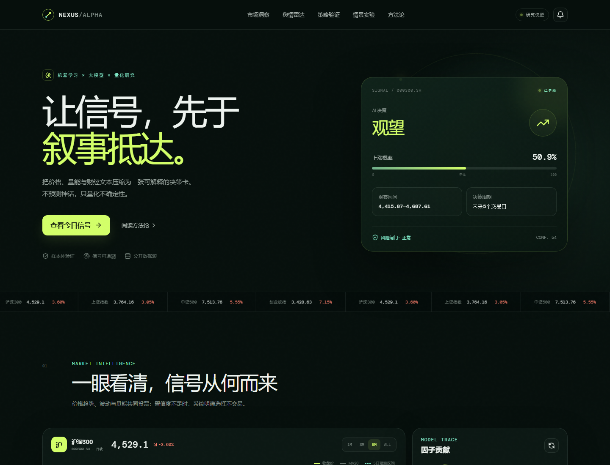

# NEXUS Alpha

面向个人研究者与高校量化实践的轻量化 AI 量化研究系统。它将 A 股公开行情、机器学习方向概率、财经新闻舆情、风险闸门和严格样本外回测统一在同一条可复现链路中。



## 为什么做这个项目

传统量化课程项目常停留在“训练一个模型、给出一个准确率”，与真实决策仍有距离。NEXUS Alpha 把重点放在三个更有应用价值的问题上：

1. 信号是否来自当时真正可获得的信息；
2. 置信度不足时，系统能否明确选择不交易；
3. 文本结论能否回到原始新闻证据，而不是成为不可审计的 AI 判断。

当前研究快照使用沪深 300 作为主标的，并提供上证指数、中证 500、创业板指的市场横截面对照。页面所示数值来自 `src/data/snapshot.json`，可通过脚本重新生成。

## 核心能力

- 多因子机器学习：5/20 日动量、均线偏离、RSI、波动率、量能、MACD、ATR。
- 文本舆情：离线金融词典稳定降级；配置 API Key 后可切换为结构化大模型分析。
- 风险闸门：方向概率不足、舆情恶化或波动上升时降低市场暴露。
- 样本外回测：70/30 时间切分、次日执行、10bp 单边交易成本、长仓/现金状态机。
- 可解释决策：模型卡、因子贡献、资讯来源、命中语义与研究假设完整展示。
- 反事实实验：政策增量、舆情冲击、流动性收缩和成本参数会联动改变概率与仓位。
- 产品化交互：响应式布局、动态图表、移动端适配、打印研究简报。

## 快速运行

前端：

```bash
npm install
npm run dev
```

访问 `http://localhost:5173`。

重新拉取公开行情、训练模型并生成快照：

```bash
python -m pip install -r backend/requirements.txt
python backend/generate_snapshot.py
```

可选 API 服务：

```bash
uvicorn backend.main:app --reload --port 8000
```

接口包括：

- `GET /api/health`
- `GET /api/snapshot`
- `POST /api/analyze-news`

若配置 `OPENAI_API_KEY`，新闻分析接口使用大模型返回约束 JSON；未配置或调用失败时自动回退到本地金融词典，不影响离线演示。

## 验证

```bash
npm run build
python -m pytest backend/tests -q
```

## 工程结构

```text
├─ backend/
│  ├─ quant_engine.py          # 特征、模型、回测、图表数据
│  ├─ sentiment.py             # 词典与可选 LLM 文本引擎
│  ├─ generate_snapshot.py     # 公开数据抓取和离线快照生成
│  ├─ main.py                  # FastAPI 服务
│  └─ tests/                   # 因果特征与回测单测
├─ docs/
│  ├─ MARKET_RESEARCH.md       # 竞品调研
│  └─ PROJECT_REPORT.md        # 项目背景、方案与结果分析
├─ src/
│  ├─ App.tsx                  # 产品页面与交互
│  ├─ styles.css               # 视觉系统与响应式布局
│  └─ data/snapshot.json       # 可复现研究快照
└─ dist/                       # 生产构建产物
```

## 重要说明

本项目用于课程实践和研究展示，不构成投资建议。回测结果不代表未来收益；公开数据可能存在延迟、缺失和修订。项目刻意保留当前样本外 AUC 低于 0.5 的真实结果，用来展示“模型没有优势时不交易”比伪造漂亮指标更重要。

