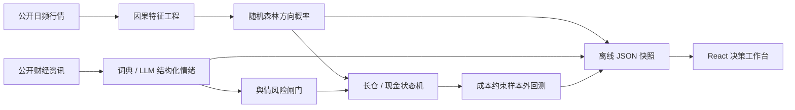

# NEXUS Alpha 项目报告

## 摘要

NEXUS Alpha 是一个基于机器学习、可插拔大模型和量化回测的轻量化 A 股研究系统。项目以沪深 300 为核心标的，将日频 OHLCV 因子、公开财经资讯、方向概率、风险闸门和样本外绩效放在统一产品页面中。它的创新重点不是“用 AI 保证预测”，而是把不确定性、证据和失败结果产品化，让研究者知道何时应行动、何时应等待。

## 一、项目背景与现实问题

个人投资者和初级研究者通常面临三类割裂：

1. 行情、新闻与策略工具分散，结论需要手工拼接；
2. 机器学习实验关注准确率，忽略时间泄漏、交易成本和市场暴露；
3. 大模型擅长生成叙事，却容易把缺少证据的总结包装成确定判断。

与此同时，机构级终端功能强但昂贵、复杂，难以用于课程和轻量场景。因此本项目选择“研究辅助”而非“自动下单”作为现实定位：用户在一个页面看到市场状态、模型概率、风险来源、新闻证据和历史检验，再决定是否进入更深的人工研究。

### 1.1 金融市场的五层底层约束

本项目不把金融预测视为普通的监督学习问题。市场同时具有非平稳、高噪声、肥尾、交易摩擦、信息边界和对抗博弈属性，因此模型能力必须服从以下优先级：

1. **数据完整性与时间因果**：多源数据需要按真实可获得时间对齐，复权、停牌、涨跌停与异常事件必须显式处理；任何滚动特征、预测标签及成交假设都不得越过当时点信息边界。
2. **轻量化多模型融合**：结构化时序模型刻画价量和资金行为，轻量语义模型提取新闻、公告与政策事件；文本信号只有在来源校验通过后才能修正量价信号，并必须保留驱动归因。
3. **时序训练与样本外验证**：禁止随机切分时间序列。训练、验证和测试按时间推进，结合 Walk-Forward、独立极端行情压力测试和多维风险收益指标区分“拟合历史”与“预测未来”。
4. **现实交易仿真与线上闭环**：模型概率需要经过交易成本、成交限制、仓位上限和波动率预算后才能映射为持仓；实盘成交、滑点与盈亏数据应回流用于漂移监控和定期重训。
5. **风险优先与事实约束**：LLM 输出需要接受来源可信度、原文与主体一致性校验；净值回撤、集中度及极端波动风控对模型信号拥有最终否决权。

五层约束遵循“数据可信度 > 验证严谨性 > 执行真实性 > 模型复杂度”的顺序。当前版本已经实现日频因果特征、时间切分、次日执行、基础成本、舆情风险闸门和可解释快照；盘口级点时数据库、压缩语义模型、完整 Walk-Forward、市场冲击仿真及在线漂移治理属于后续工程路线，不作为当前成果宣称。

## 二、产品目标

- 现实意义：使用公开 A 股数据，解决日频择时和资讯筛选的真实工作流问题；
- 创新性：引入舆情风险闸门、结构化证据与反事实情景实验；
- 应用价值：个人电脑可运行、快照可复现、数据和模型可替换、可渐进接入真实 API；
- 可信性：优先避免未来数据泄漏，不隐瞒负面结果，不输出收益承诺。

## 三、总体技术方案

### 3.1 数据层

- 通过 AKShare 获取沪深 300、上证指数、中证 500、创业板指公开日线；
- 获取贵州茅台、宁德时代、招商银行、中际旭创、比亚迪、中国平安的真实前复权日线，保留开高低收、成交量、成交额与换手率；
- 通过公开财经资讯接口获取最新 A 股新闻；
- 生成时间戳快照，页面不依赖实时网络，保证答辩演示稳定；
- 重新运行脚本即可更新数据与模型结果。

### 3.2 特征工程

使用 9 个只依赖当前及过去数据的日频因子：

- 5 日与 20 日收益动量；
- 20 日与 60 日均线偏离；
- 14 日 RSI；
- 20 日年化波动率；
- 对数成交量 Z-score；
- 标准化 MACD；
- 14 日 ATR/价格。

标签定义为未来 5 个交易日收益是否超过 0.2%。最后 5 行因未来收益未知而不进入训练。

### 3.3 机器学习模型

使用带类别平衡的随机森林分类器：240 棵树、最大深度 6、最小叶节点 16。选择它的原因是：

- 对非线性和因子交互敏感；
- 对小型表格数据稳定，CPU 即可训练；
- 可以直接输出方向概率和特征重要度；
- 相比深度时序模型更容易审计、复现和快速迭代。

训练集为按时间排序后的前 70%，最后 30% 完全作为样本外测试。研究页的 AUC、准确率和策略曲线均来自测试集。

### 3.4 信号与风险控制

采用有滞回的长仓/现金状态机：

- 概率 ≥ 0.56：进入或保持长仓；
- 概率 ≤ 0.48：退出至现金；
- 中间区域：保持上一状态，减少频繁反转。

信号在下一交易日执行，并按每次仓位变化计入 10bp 成本。当前版本不使用杠杆、不做空，符合轻量研究与风险教育定位。

### 3.5 舆情与大模型融合

离线模式使用金融领域词典，对上涨、回购、超预期、减持、风险、处罚等方向词进行加权，并抽取政策、监管、流动性、基本面和资金面标签。

在线模式通过 OpenAI Responses API 输出受约束 JSON：

- `score`：-1 到 1；
- `label`：积极/中性/消极；
- `impact`：高/中/低；
- `horizon`：影响期限；
- `rationale`：不超过 40 字的依据；
- `tags`：最多 3 个风险标签。

任何 API 缺失或解析失败都会自动回退到本地词典，避免产品不可用。模型仅分析给定文本，并在界面保留原文链接。

### 3.6 前端产品设计

技术栈为 React、TypeScript、Vite、Recharts、Framer Motion。视觉语言采用深墨绿、荧光黄绿和薄荷青，结合低对比网格、轨道、扫描线和克制的微动画，形成偏机构研究台而非传统“蓝色大屏”的质感。

主要模块：

1. 今日信号：动作、概率、区间、周期、风险闸门；
2. 真实股票工作台：个股切换、K 线/走势、成交量、均线、52 周位置；
3. 市场洞察：指数模型与因子贡献；
4. 舆情雷达：市场温度、新闻证据流、AI 归因；
5. 策略验证：累计净值、回撤、AUC、暴露；
6. 情景实验：政策、舆情、流动性与成本敏感性；
7. 方法论：完整研究链路、模型卡和打印简报。

## 四、创新点

### 4.1 “不交易”作为有效产品输出

大多数演示每天都给出买卖结论。本项目设置中性区与滞回状态：当概率接近 0.5、模型样本外能力不足时，页面明确显示“观望”。这更符合真实风险管理。

### 4.2 舆情风险闸门

文本情绪不直接决定交易，而是作为风险预算的门控变量。负面事件聚集时降低建议暴露，既利用大模型的文本能力，又限制其在数值决策中的权力。

### 4.3 证据优先的 AI 交互

每条新闻保留原始来源、发布时间、链接、标签和语义依据。用户点击资讯即可查看“为什么被判为积极或消极”，避免只有一个不可解释分数。

### 4.4 反事实情景实验室

用户可以主动改变市场假设和交易成本，看方向概率、5 日隐含收益、建议仓位与成本后年化如何同时变化。该模块把静态看板升级为可探索的决策工具。

## 五、结果分析

当前快照数据截至 2026-07-17。样本外结果为：

| 指标 | 结果 |
|---|---:|
| 样本外累计收益 | +6.26% |
| 沪深 300 同期收益 | +15.07% |
| 策略年化收益 | +0.98% |
| 年化波动率 | 9.29% |
| Sharpe | 0.151 |
| 最大回撤 | -13.50% |
| 胜率 | 49.21% |
| 平均市场暴露 | 16.07% |
| 仓位切换 | 36 次 |
| 测试 AUC | 0.470 |

### 5.1 有效发现

- 策略在很低的市场暴露下获得正收益，最大回撤控制在 -13.5%，说明滞回和现金状态对资本保护有作用；
- 交易次数有限，10bp 成本不会完全吞噬结果；
- 因子和文本证据能够在产品界面被追溯，工程链路完整可复现。

### 5.2 负面发现

- 累计收益明显低于买入持有；
- 测试 AUC 为 0.470，说明当前 9 个价量因子在所选样本外阶段没有稳定方向预测优势；
- 49.21% 的持仓日胜率接近随机，不能把正累计收益解释为可靠 Alpha；
- 当前新闻只有最新截面，没有历史点时新闻库，因此尚不能严谨回测“舆情 + 价格”的完整融合收益。

### 5.3 产品结论

当前正确动作是“观望”，而不是把 50.94% 的上涨概率包装成买入机会。这个结果本身验证了产品设计：系统能够在模型优势不足时主动拒绝制造确定性。现阶段更适合作为研究筛选和风险监控工具，不适合直接连接自动实盘。

## 六、局限与改进路线

1. 建立带可获得时间的历史新闻库，开展真正的文本因子回测；
2. 使用滚动/扩展窗口训练，监测参数和特征在不同市场状态下的漂移；
3. 增加指数成分股横截面排序，通常比单一指数方向预测更适合机器学习；
4. 加入基于校准曲线的概率校准和置信度拒绝机制；
5. 模拟涨跌停、停牌、滑点、税费和成交容量；
6. 接入纸面交易和样本外在线监控，比较实时策略与回测的偏差；
7. 在积累足够历史后，对价格模型、词典模型和 LLM 模型做消融实验。

## 七、现实应用价值

- 个人投资研究：每日快速筛选是否值得进一步研究；
- 高校教学：演示从数据、特征、模型、回测到产品的完整闭环；
- 小型投研团队：作为可替换数据源和模型的轻量决策前台；
- 风险教育：展示低置信、成本、回撤与市场暴露如何改变策略价值。

## 八、风险声明

本项目仅用于课程实践和研究，不构成投资建议。所有预测均存在误差，历史回测不代表未来表现。公开数据可能延迟、缺失或修订；任何实盘使用前都需要更严格的数据许可、交易规则建模、纸面验证和风险审批。
